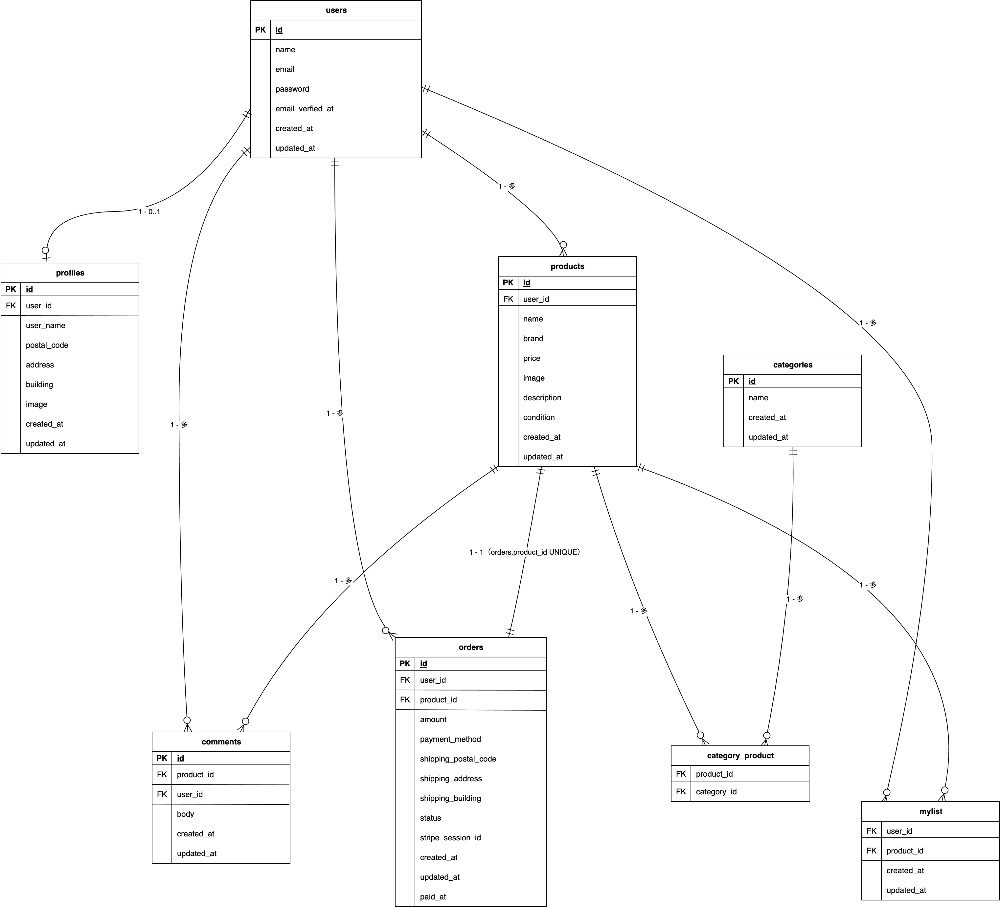

# 模擬案件_フリマアプリ
模擬案件フリマアプリ（Laravel 8 + MySQL）。
商品一覧/詳細/検索、出品、いいね、コメント、購入フロー（模擬Stripe。Webhookなし、successで支払い確認）を実装しています。

## 環境構築

**Docker ビルド**

1. `git clone git@github.com:komanoakari/Practice-Project1.git`
2. cd Practice-Project1
3. DockerDesktop アプリを立ち上げる
4. `docker compose up -d --build`

**Laravel 環境構築**

> `.env` は `./src/.env` に置きます。

1. `docker compose exec php bash`
2. `composer install`
3. `cp .env.example .env`
4. .env に以下の環境変数を追加

```text
APP_URL=http://localhost:8016

DB_CONNECTION=mysql
DB_HOST=mysql
DB_PORT=3306
DB_DATABASE=laravel_db
DB_USERNAME=laravel_user
DB_PASSWORD=laravel_pass

# MailHog
MAIL_MAILER=smtp
MAIL_HOST=mailhog
MAIL_PORT=1025
MAIL_ENCRYPTION=null
MAIL_FROM_ADDRESS=noreply@example.test
MAIL_FROM_NAME="${APP_NAME}"

# 画像を使う場合
FILESYSTEM_DISK=public
```

5. .env を編集したら反映

```bash
php artisan config:clear
```

6. アプリケーションキーの作成

```bash
php artisan key:generate
```

7. マイグレーション & 初期データ投入

```bash
php artisan migrate --seed
```

8. 画像を使う場合は公開リンク作成

```bash
php artisan storage:link
```

## 使用技術(実行環境)

- PHP: 8.1.33
- Laravel: 8.83.29
- Nginx: 1.21.1
- MySQL: 8.0.26
- phpMyAdmin
- MailHog
- Stripe PHP SDK: ^17.6
- Docker Desktop（Compose v2）
- Git

## 決済（Stripe）を使う場合

```bash
docker compose exec php bash
composer require stripe/stripe-php
```

## URL

- 開発環境: http://localhost:8016/
- phpMyAdmin: http://localhost:8017/（**Server** は `mysql`）
- MailHog（受信 BOX）: http://localhost:8025/（**SMTP** は `mailhog:1025`）

## phpMyAdmin ログイン

- URL: http://localhost:8017/
- Server: mysql
- Username: laravel_user
- Password: laravel_pass

## ログイン用テストアカウント

Seeder で作成されます。新規登録なしでログイン可能。

- メール：test@example.com
- パスワード：password

## ER 図


